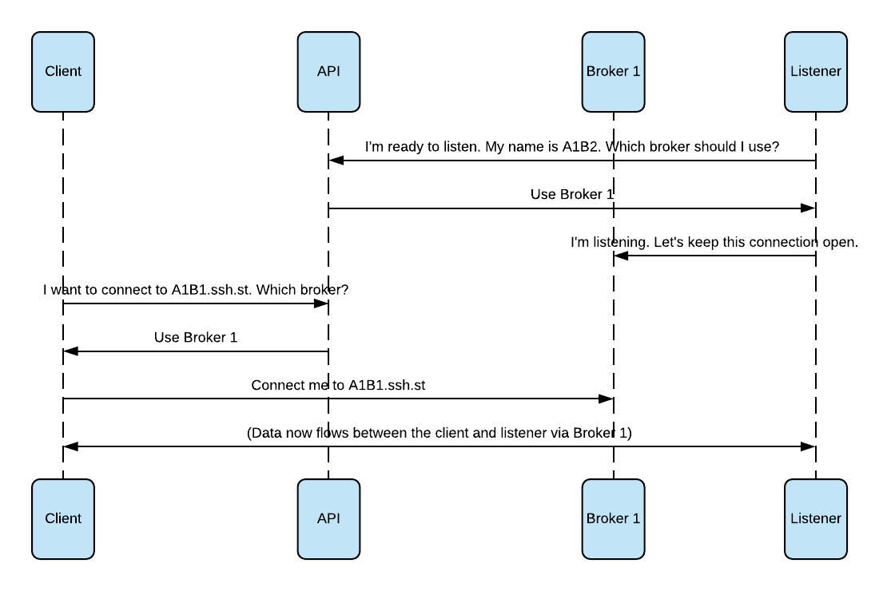

# How It Works

We recommend first checking out the [Getting Started][getting-started] guide
as it provides some of the following information in a less verbose style.

## Why?

There's at least two good reasons why you might be interested in how ssh.st works.

The first is doing your due diligence around the security of your servers and the
confidentiality of data in transit. Given the often sensitive nature of data 
transferred over SSH connections, this makes perfect sense. **If you reach the end
of this document and are not satisfied that your data is safe, or still have 
questions, reach out to us on [GitHub][github]**.

The second reason is that you are insatiably curious. Maybe thinking about novel
applications for and new combinations of existing protocols gets you as excited
as it does us. Or maybe you just really like sequence diagrams. 

## In 30 seconds or less

ssh.st consists of at least four logical systems. They are:

* The client program. This is the one you install on your laptop and setup `ssh`
  to use whenever you connect to `*.ssh.st`.

* The listener program. This is the one you download and run on the machine you
  want to connect to. 

* The ssh.st API. This central service coordinates which brokers serve which 
  listeners and clients connect to. It also powers the ssh.st website.

* The ssh.st brokers. These are responsible for forwarding the bits and bytes
  between client and listener. They are located in a handful of cities across
  the globe to minimise the latency we introduce.
  
Here's what that looks like in a sequence diagram:



## Data confidentiality

### SSH keys, certificates and configuration

ssh.st makes exclusive use of SSH keypairs and [certificates][ssh-certs]. When 
you run `sshst setup` on your machine, it generates a handful of files. These
are all stored in `~/.ssh/sshst` and it adds an [`Include`][Include] line 
in `~/.ssh/config` to use the additional ssh.st-specific configuration.

* It generates an SSH private / public keypair, just like `ssh-keygen` does. These
  are stored in `ca.key` (private key) and `ca.pub` (public key). This is your
  personal SSH certificate authority (CA). We'll get to what this is for later.
  
* It then generates an additional keypair and stores it in `id_rsa` and `id_rsa.pub`.
  It then uses your SSH CA to _sign_ `id_rsa.pub` and store the resulting certificate
  in `id_rsa-cert.pub`.
  
* It writes a `known_hosts` file that trusts the ssh.st SSH CA for any subdomains of
  ssh.st. This is what stops `ssh` from prompting you to trust the host key signature
  on first login.
  
* Finally, it creates a `config` file, which is referenced by the aforementioned `Include`.
  This file configures `ssh` to use your newly-created SSH certificate (by means of
  a [`CertificateFile`][CertificateFile] directive) and `sshst` for network 
  connectivity (by means of a [`ProxyCommand`][ProxyCommand] directive).

### Hang on...

Eagle-eyed SSH aficionados among you will notice a concerning problem with the 
above description. The default configuration described above trusts the ssh.st
certificate authority when connecting to hosts, so **ssh.st _could_ transparently
intercept your data with no warning**. 

We **don't** do that, but you might understandably not want to trust us. In that
case, we recommend removing the line from `~/.ssh/sshst/known_hosts`. This will
result in `ssh elegant_kilby.ssh.st` showing the following warning upon connection:

```
The authenticity of host 'elegant_kilby.ssh.st (<no hostip for proxy command>)' can't be established.
RSA key fingerprint is SHA256:XZrokXFcyus0M7msEM9aakSzet8CysGag0trZbWGh2M.
Are you sure you want to continue connecting (yes/no)?
```

You can verify that this fingerprint is safe to trust by viewing the log lines
emitted by the `sshst listen` on startup:

```
Generated host key: SHA256:XZrokXFcyus0M7msEM9aakSzet8CysGag0trZbWGh2M
```

<p class="text-info"><span class="fas fa-info-circle"></span> We have plans 
to improve the UX of the trustless mode of operation,  which can be seen in our 
public <a href="https://github.com/glassechidna/ssh.st/blob/master/ROADMAP.md">roadmap</a>.</p>

### Why certificates?

This is a reasonable question:

> _Why do we need to have our own SSH CA? It's new to me and I'm more familiar
> with regular public keys._

Firstly: fair enough, you needn't use the generated certificate at all. Feel 
free to delete `ca.key` and `ca.pub` and remove the `CertificateFile` directives.
You will also want to update the trusted SSH public key in the ssh.st dashboard.

Before you do that, consider the benefits of certificates:

* You can configure ssh.st to trust a _single_ public key to identify you and
  then have different SSH certificates on each of your machines. This is useful
  as you can then identify which machine logged into a listener in the ssh.st
  connection audit trail.
  
* You can do the above and distribute SSH certificates to your colleagues. This
  is a **much** better idea than sharing a single private key among every one.
  
* SSH certificates can have additional restrictions placed upon them. To list a
  few:
  
  * Certificates can have expiry dates embedded in them. Want to grant a 
    contractor access for only a few hours or months? Set an expiry date in the
    certificate. 
  
  * Want to disallow port-forwarding and only allow shell access? You can do 
    that.
     
  * Want to _only_ allow port-forwarding and no shell? That's fine too.
  
  * You can even restrict them to only running one specific command! 

## Network connectivity

In its most basic mode, you invoke `ssh ssh.st whoami`. In this case, no listener
is involved and it's just an A->B connection between you and the ssh.st API.
Authentication is handled using a regular SSH handshake -- there's no additional
auth tokens involved. If ssh.st can't identify you by the public keys your
client presents, you'll be informed.

In a more useful mode of operation, you will have a client and a listener. The
listener is started by invoking `sshst listen -t <TOKEN> -n <OPTIONAL NAME>`. 
The listener first connects to the API and asks which broker it should connect
to. Brokers are the servers responsible for forwarding connections between client
and listener. 

Brokers are globally internet accessible, i.e. not behind a  [NAT][nat] as your 
listener might be. Machines behind NATs and firewalls can usually initiate
outbound connections, but often cannot serve incoming traffic. By having both
client and listener connect to a globally-accessible intermediary, neither needs
to be accessible themselves.

Brokers are also geographically distributed. If you use a broker that is close to
both you and your listener, your connection will incur less latency. 

A single listener can service multiple client sessions, even at the same time.
These multiple client sessions are multiplexed over the single connection initiated
by the listener. Additionally, a _control channel_ is multiplexed in the same
connection, to enable actions like the client initiating a listener termination.  

### Dealing with poor networks

An unfortunate reality of the modern Internet is that we often find ourselves
in situations where we have spotty connectivity. This doesn't just mean drop-outs,
you can have a rock solid connection at a wi-fi hotspot in a café and the only
ports that are open are 80 and 443 for web surfing -- SSHing from here is usually
a dead-end. 

Likewise in an office environment, there might be a corporate proxy
that only allows web access so the employer can inspect traffic and the proxy
only speaks HTTP(S).

To maximise your chance of a successful SSH session, we therefore _tunnel_ all
SSH connections from the client or listener to ssh.st in [websockets][websockets].
Websockets provide a persistent bidirectional stream between browser and server,
enabling use-cases like chat or gaming sites to provide a latency-free experience
without polling. Due to their ubiquity and use by high-profile websites, most
proxies have been upgraded to support websockets.

<p class="text-info"><span class="fas fa-info-circle"></span> As detailed in 
our <a href="https://github.com/glassechidna/ssh.st/blob/master/ROADMAP.md">roadmap</a>, 
we plan on improving the situation further by trying a series of connection types 
in increasingly pessimistic order.  This will allow the service to operate in even 
worse network conditions, but avoid the overhead where it unnecessary.</p>

[getting-started]: getting-started
[github]: https://github.com/glassechidna/ssh.st
[ssh-certs]: https://man.openbsd.org/ssh-keygen.1#CERTIFICATES
[Include]: https://man.openbsd.org/ssh_config#Include
[CertificateFile]: https://man.openbsd.org/ssh_config#CertificateFile
[ProxyCommand]: https://man.openbsd.org/ssh_config#ProxyCommand
[roadmap]: https://github.com/glassechidna/ssh.st/blob/master/ROADMAP.md
[nat]: https://en.wikipedia.org/wiki/Network_address_translation
[websockets]: https://en.wikipedia.org/wiki/WebSocket
